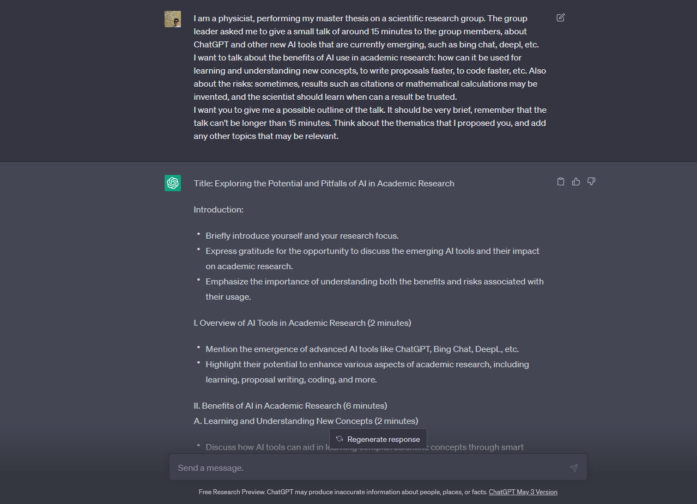

# Overview

## Introduction:

    Briefly introduce yourself and your research focus.
    Express gratitude for the opportunity to discuss the emerging AI tools and their impact on academic research.
    Emphasize the importance of understanding both the benefits and risks associated with their usage.

## I. Overview of AI Tools in Academic Research (2 minutes)

    Mention the emergence of advanced AI tools like ChatGPT, Bing Chat, DeepL, etc.
    Highlight their potential to enhance various aspects of academic research, including learning, proposal writing, coding, and more.

## II. Benefits of AI in Academic Research (6 minutes)
### A. Learning and Understanding New Concepts (2 minutes)

    Discuss how AI tools can aid in learning complex scientific concepts through smart information retrieval, summarization, and explanation generation.
    Emphasize the potential for rapid knowledge acquisition and the ability to explore interdisciplinary connections.

### B. Accelerating Proposal Writing and Literature Review (2 minutes)

    Explore how AI tools can facilitate the proposal writing process by automating tasks such as literature review, identifying knowledge gaps, and generating summaries.
    Discuss the potential for increased efficiency and improved proposal quality through AI assistance.

### C. Enhancing Coding and Data Analysis (2 minutes)

    Highlight the role of AI tools in automating repetitive coding tasks, optimizing algorithms, and improving data analysis processes.
    Discuss the potential for faster experimentation, more reliable results, and increased reproducibility.

## III. Risks and Considerations (5 minutes)
### A. Trustworthiness of Results (2 minutes)

    Discuss the need for caution when relying on AI-generated results, especially in complex scientific calculations or citations.
    Emphasize the importance of critical thinking and verifying AI-generated information through manual verification and peer review.

### B. Ethical Considerations (2 minutes)

    Address ethical concerns surrounding AI, such as bias in training data, privacy issues, and the potential impact on employment in research.
    Advocate for responsible usage of AI tools, including transparency, accountability, and ethical guidelines.

### C. Balancing Human Expertise with AI Tools (1 minute)

    Highlight the importance of maintaining the central role of human expertise in scientific research.
    Discuss how AI tools should be viewed as complementary aids rather than replacements for human intelligence.

## Conclusion:

    Recap the benefits of AI tools in academic research, including learning, proposal writing, coding, and data analysis.
    Stress the importance of being aware of the risks associated with AI usage and the need for critical evaluation of AI-generated results.
    Encourage open discussions, collaboration, and continuous learning to harness the potential of AI tools effectively.

# Use examples:

## ChatGPT

I am a physicist, performing my master thesis on a scientific research group. The group leader asked me to give a small talk of around 15 minutes to the group members, about ChatGPT and other new AI tools that are currently emerging, such as bing chat, deepl, etc.
I want to talk about the benefits of AI use in academic research: how can it be used for learning and understanding new concepts, to write proposals faster, to code faster, etc. Also about the risks: sometimes, results such as citations or mathematical calculations may be invented, and the scientist should learn when can a result be trusted. 
I want you to give me a possible outline of the talk. It should be very brief, remember that the talk can't be longer than 15 minutes. Think about the thematics that I proposed you, and add any other topics that may be relevant.

    Introduction to AI tools in academia: Start by introducing the topic of AI tools in academia and why they're becoming more prevalent. You can mention some of the tools you mentioned in your prompt draft, such as ChatGPT, Github Copilot, Bing Chat, and DeepL Write.

    Pros and cons of using AI tools: Discuss the advantages and disadvantages of using AI tools in academic research. Some potential pros could include increased efficiency and productivity, while cons might include the risk of errors and biases in the data.

    Areas where AI excels: Discuss specific areas where AI tools have been particularly effective in academic research, such as natural language processing, image analysis, and data mining.

    Areas where AI struggles: Discuss areas where AI tools have limitations and may not be as effective, such as understanding complex and nuanced human behavior or making ethical and moral decisions.

    Ethical considerations: Discuss the ethical considerations involved in using AI tools in academia, such as data privacy, bias, and transparency. Consider discussing potential solutions to address these concerns, such as increasing transparency in AI algorithms and providing users with more control over their data.

    Future of AI in academia: Finally, discuss the potential future of AI in academia and the implications it may have for research and education. Consider discussing potential advancements in AI tools and how they may impact the field.

# Use Cases and limitations for AI in Academia

# How to use Large Language Models (LLM) for Scientists Living Under a Rock (SLUR)

## Be Specific
ChatGPT is a tool that can be used to generate text. It relies on the given context to generate the next word. It is a very powerful tool that can be used as an assistant to get things explained, 

## Train the inputs
It will rarely give you what you want at first. It particularly excells if you ask it to review its previous output, checking for any possible mistakes, and then ask it to continue from there. It will often give you a more coherent response.

    juanjo:

    Básicamente ser muy específico

    Entrenar los inputs, porque al principio nunca te da lo que quieres

    Paciencia porque el tamaño de ventana es limitado y de momento Chatgpt tiene poca memoria (4092 bloques si no recuerdo mal)

    Y es útil para algunas cosas pero no es dios

    No te va a dar un paper, pero sí te quita síndrome de página en blanco

    Da ideas chulas, pero eres tú el que determina

    Escribe Código pero a veces con fallos

    Es herramienta para facilitar el trabajo, no para hacerlo

    Funciona muy bien también para escribir en inglés, mete expresiones nativas bastante bien